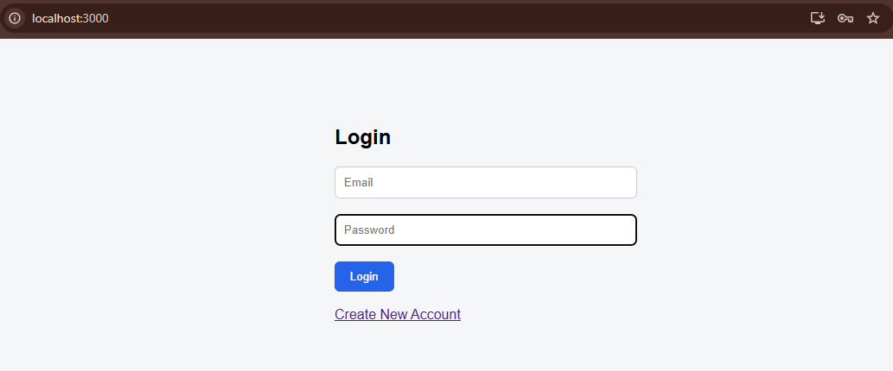
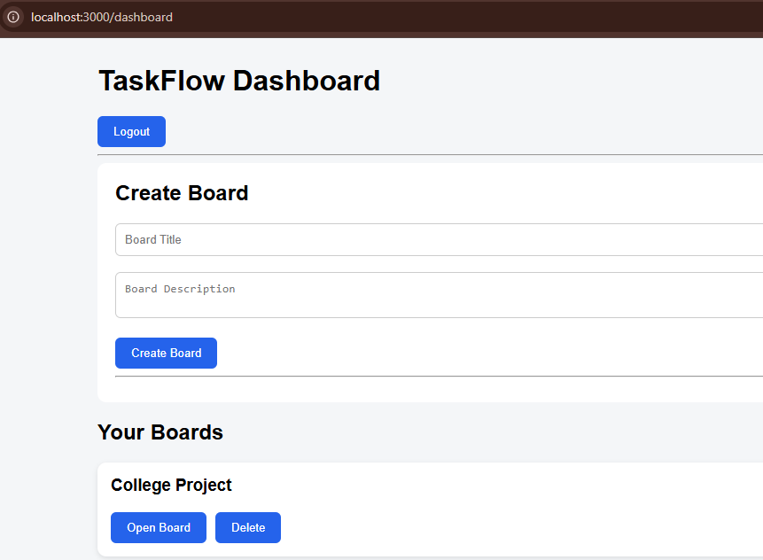
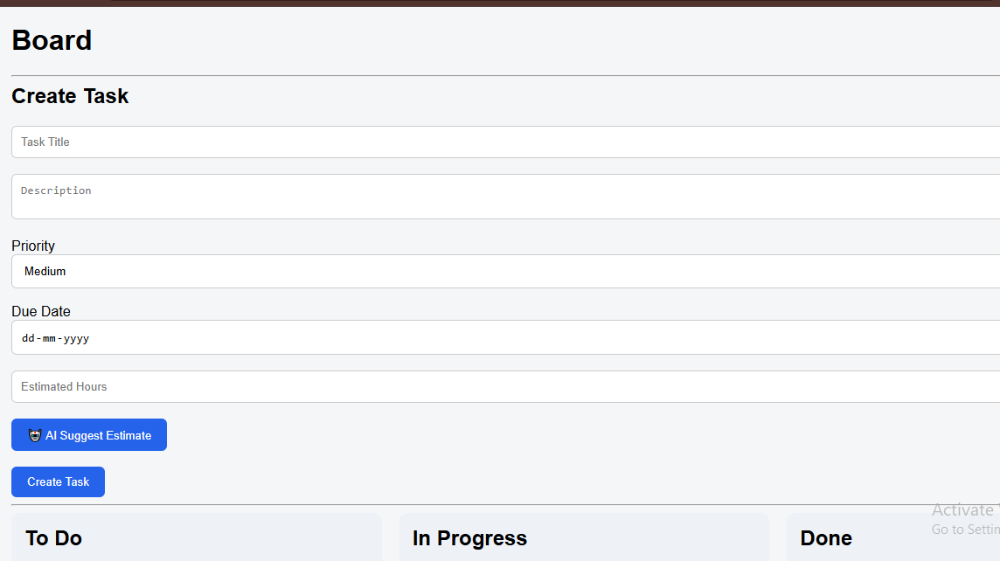
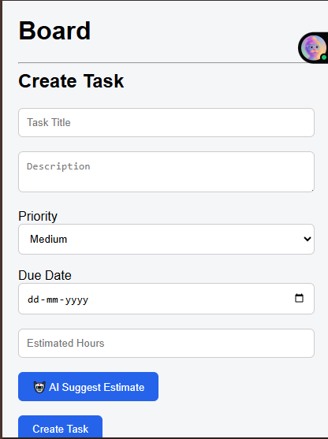

# TaskFlow - AI Task Manager


## Overview

TaskFlow is a full-stack task management application that helps users organize their work using boards and tasks. It includes secure authentication, board management, task tracking, and an AI-powered feature that estimates task priority and completion time based on the task description.

---

## Features

* User Registration and Login (JWT Authentication)
* Create, Edit and Delete Boards
* Create, Edit and Delete Tasks
* Organize tasks into:

  * To Do
  * In Progress
  * Done
* Set task priority
* Due date support
* Estimated hours
* AI-powered task estimation
* Responsive user interface

---

## Screenshots

### Login Page



### Dashboard



### Board View



### Mobile View



---

## Tech Stack

### Frontend

* React.js
* React Router
* Axios
* CSS

### Backend

* Node.js
* Express.js
* JWT Authentication
* bcrypt

### Database

* MongoDB
* Mongoose

### AI

* LLM API : Google Gemini API

---

## Folder Structure

taskflow/

├── client/

└── server/

---

## Installation

### Clone Repository

```bash
git clone <repository-url>
cd taskflow
```

### Backend Setup

```bash
cd server
npm install
```

Create a `.env` file inside the server folder.

Run:

```bash
npm run dev
```

### Frontend Setup

```bash
cd client
npm install
npm start
```

Frontend runs on:

```
http://localhost:3000
```

Backend runs on:

```
http://localhost:5000
```

---

## Environment Variables

Create a `.env` file inside the server directory.

Example:

```
PORT=5000
MONGO_URI=your_mongodb_connection_string
JWT_SECRET=your_jwt_secret
LLM_API_KEY=your_api_key
```

Also include a `.env.example` file with placeholder values only.

---

## AI Integration

### LLM Used

Google Gemini API

### Why this LLM?

Google Gemini API was chosen for the AI feature in TaskFlow because it provides a strong balance of performance, cost-effectiveness, and ease of integration for student-level full-stack projects.

Compared to other LLMs, Gemini offers fast response times and good quality reasoning for structured outputs like task estimation and priority classification. This is important for TaskFlow, where the AI must quickly analyze short inputs (task title and description) and return predictable, structured results.

Another key reason is accessibility. Gemini API is easier to access for developers through Google AI Studio, with straightforward API setup and generous free-tier usage, making it suitable for development and testing without high cost.

Additionally, Gemini handles instruction-based prompts well, which allows the backend to reliably extract:

Estimated completion time
Suggested priority level

This makes it a good fit for lightweight productivity automation features like the one implemented in this project.

### How it Works

1. User enters task title and description.
2. Frontend sends data to the backend.
3. Backend sends a prompt to the LLM.
4. The LLM predicts:

   * Estimated Hours
   * Suggested Priority
5. The frontend automatically fills these values.

---

## API Documentation

### Authentication

POST `/auth/register`

Registers a new user.

POST `/auth/login`

Authenticates a user.

---

### Boards

GET `/boards`

Returns all boards.

POST `/boards`

Creates a board.

DELETE `/boards/:id`

Deletes a board.

---

### Tasks

GET `/tasks/:boardId`

Returns tasks for a board.

POST `/tasks`

Creates a task.

PUT `/tasks/:id`

Updates a task.

DELETE `/tasks/:id`

Deletes a task.

---

### AI

POST `/ai/suggest`

Returns estimated hours and suggested priority for a task.

---

## Live Demo

Frontend:

(Add deployed frontend URL)

Backend:

(Add deployed backend URL)

### Test Credentials

Email:

```
tanvi@gmail.com
```

Password:

```
123456
```

---

## Known Limitations

* No drag-and-drop task movement.
* Edit task uses browser prompts instead of a form.
* No email verification.
* No password reset.
* Limited AI validation.


---

## Future Improvements

* Drag-and-drop Kanban board
* Dark mode
* File attachments
* Comments on tasks
* Team collaboration
* Notifications
* Calendar integration
* Real-time updates using WebSockets
* Better analytics dashboard

---

## Author

**Tanvi Gupta**  
Full Stack Developer 
Project: TaskFlow – AI-powered task management system
